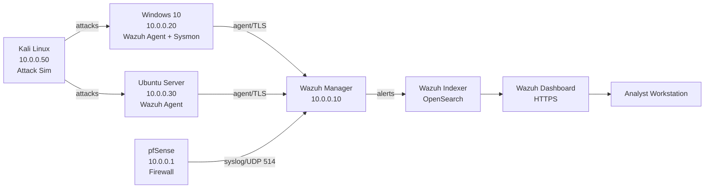
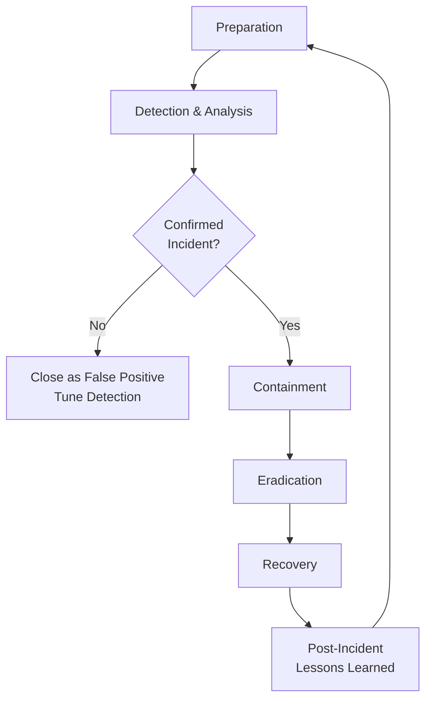
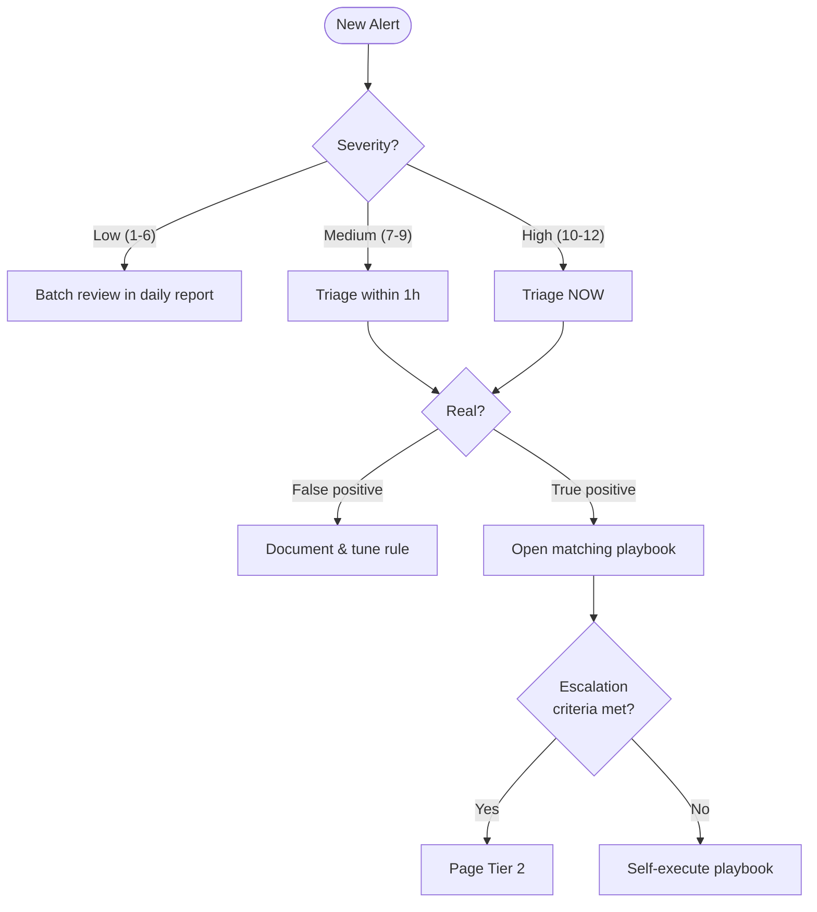

# Diagrams

## Network & Data Flow (Mermaid)

```mermaid
flowchart LR
    Kali[Kali Linux<br/>10.0.0.50<br/>Attack Sim]
    Win[Windows 10<br/>10.0.0.20<br/>Wazuh Agent + Sysmon]
    Ubu[Ubuntu Server<br/>10.0.0.30<br/>Wazuh Agent]
    Pf[pfSense<br/>10.0.0.1<br/>Firewall]
    Mgr[Wazuh Manager<br/>10.0.0.10]
    Idx[Wazuh Indexer<br/>OpenSearch]
    Dash[Wazuh Dashboard<br/>HTTPS]
    Analyst[Analyst Workstation]

    Kali -- attacks --> Win
    Kali -- attacks --> Ubu
    Win -- agent/TLS --> Mgr
    Ubu -- agent/TLS --> Mgr
    Pf  -- syslog/UDP 514 --> Mgr
    Mgr -- alerts --> Idx
    Idx --> Dash
    Dash --> Analyst
```

## Incident Lifecycle (NIST 800-61r2)

```mermaid
flowchart TD
    A[Preparation] --> B[Detection & Analysis]
    B --> C{Confirmed<br/>Incident?}
    C -- No --> Z[Close as False Positive<br/>Tune Detection]
    C -- Yes --> D[Containment]
    D --> E[Eradication]
    E --> F[Recovery]
    F --> G[Post-Incident<br/>Lessons Learned]
    G --> A
```

## Alert Triage Decision Tree

```mermaid
flowchart TD
    Alert([New Alert]) --> Sev{Severity?}
    Sev -- "Low (1-6)" --> Batch[Batch review in daily report]
    Sev -- "Medium (7-9)" --> Triage[Triage within 1h]
    Sev -- "High (10-12)" --> Now[Triage NOW]
    Triage --> Real{Real?}
    Now --> Real
    Real -- "False positive" --> Tune[Document & tune rule]
    Real -- "True positive" --> Play[Open matching playbook]
    Play --> Esc{Escalation<br/>criteria met?}
    Esc -- "Yes" --> Tier2[Page Tier 2]
    Esc -- "No" --> Cont[Self-execute playbook]
```
